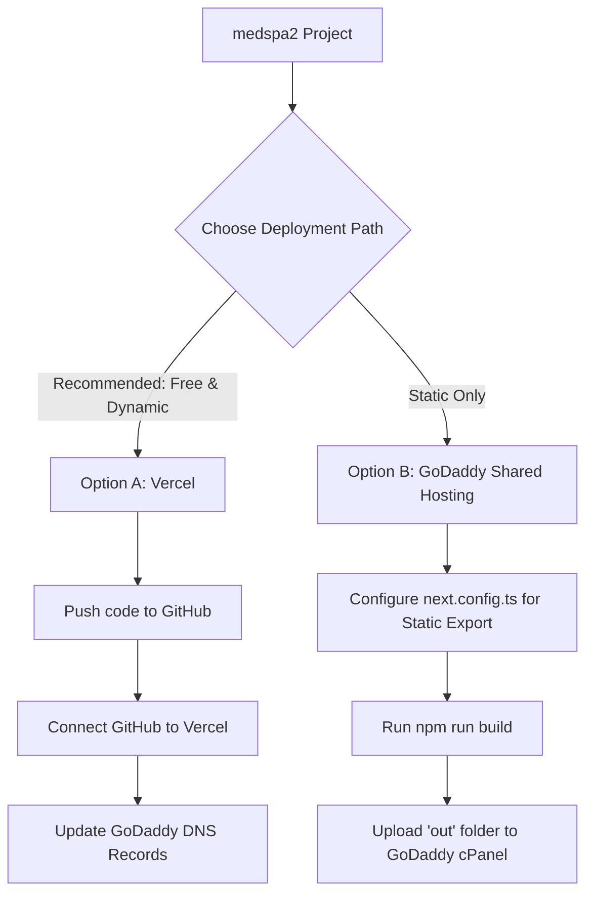

# 🚀 Next.js Deployment Guide: Connecting Your GoDaddy Domain

This guide provides step-by-step instructions to get your **medspa2** Next.js website online using your **GoDaddy** domain.

Since your project is built with **Next.js 16** (a Node.js framework), you have a couple of deployment options. We will cover the easiest and most recommended method first (using **Vercel**), followed by GoDaddy-specific configurations and static hosting alternatives.

---

## ⚠️ Critical Warning About GoDaddy Hosting
> [!WARNING]
> **Do not buy standard GoDaddy Shared Web Hosting (cPanel) for this project.**
> Standard shared hosting only supports PHP and static HTML. It **cannot** run Next.js server-side processes or standard Node.js applications out of the box. 
> 
> Instead, you should deploy the application using a specialized frontend platform like **Vercel** (which is completely **free** for personal/hobby projects) and then simply link your GoDaddy domain to it.

---

## 🗺️ Deployment Methods Overview

We recommend **Option A** because it is free, takes less than 5 minutes, includes automatic SSL (HTTPS), and deploys updates automatically every time you push code to GitHub.



---

## 🌟 Option A: Deploying on Vercel (Highly Recommended)
Vercel is the platform created by the developers of Next.js. It offers the fastest, most reliable, and free hosting for Next.js applications.

### Step 1: Upload Your Project to GitHub
Vercel deploys directly from your GitHub repository.
1. Go to [GitHub](https://github.com/) and log in (or create a free account).
2. Create a new **private** or **public** repository named `medspa2`. (Leave "Initialize repository with README, .gitignore" unchecked).
3. Open your terminal in the project directory (`C:\Users\hp Pavilion\Desktop\medspa2`) and run these commands to push your code:
   ```bash
   git init
   git add .
   git commit -m "Initial commit"
   git branch -M main
   git remote add origin https://github.com/YOUR_GITHUB_USERNAME/medspa2.git
   git push -u origin main
   ```
   *(Replace `YOUR_GITHUB_USERNAME` with your actual GitHub username).*

### Step 2: Deploy Your Project on Vercel
1. Go to [Vercel](https://vercel.com/) and sign up using your **GitHub account**.
2. Click the **"Add New..."** button and select **"Project"**.
3. You will see a list of your GitHub repositories. Click **"Import"** next to `medspa2`.
4. Leave the default settings (Vercel automatically detects Next.js, configures the build settings, and prepares your environment).
5. Click **"Deploy"**.
6. Within a minute, your website will be live on a free `.vercel.app` subdomain (e.g., `medspa2.vercel.app`).

### Step 3: Link Your GoDaddy Domain to Vercel
Now, let's configure your GoDaddy domain to point to your new Vercel deployment.
1. Log in to your **Vercel Dashboard** and go to your project.
2. Navigate to **Settings** > **Domains**.
3. In the input box, type your GoDaddy domain (e.g., `yourdomain.com` or `www.yourdomain.com`) and click **Add**.
4. Vercel will recommend adding both `yourdomain.com` (redirecting) and `www.yourdomain.com`. Select the recommended setup.
5. Vercel will display the specific **DNS records** you need to add to GoDaddy. It usually looks like this:
   - **Type**: `A`, **Name**: `@`, **Value**: `76.76.21.21`
   - **Type**: `CNAME`, **Name**: `www`, **Value**: `cname.vercel-dns.com.`

---

## 🎯 Step 4: Configuring DNS in GoDaddy
Once Vercel gives you the DNS records, you need to add them to your GoDaddy dashboard:

1. Log in to your [GoDaddy Domain Portfolio](https://dcc.godaddy.com/domains).
2. Click on the three dots next to your domain name and select **Manage DNS** (or click on your domain name and select the **DNS** tab).
3. **Delete any existing A records** with Name `@` that point to GoDaddy IP addresses.
4. **Delete any existing CNAME records** with Name `www`.
5. Add the new records provided by Vercel:
   
   #### Record 1: The Apex Domain (A Record)
   * **Type**: `A`
   * **Name**: `@`
   * **Value/Points to**: `76.76.21.21`
   * **TTL**: `Default` or `1 Hour`

   #### Record 2: The www Subdomain (CNAME Record)
   * **Type**: `CNAME`
   * **Name**: `www`
   * **Value/Points to**: `cname.vercel-dns.com.` *(Make sure to include the dot at the end if GoDaddy allows it)*
   * **TTL**: `Default` or `1 Hour`

6. Save your changes.

> [!NOTE]
> DNS changes can take anywhere from a few minutes to 24 hours to propagate globally. Vercel will automatically generate a free SSL certificate (HTTPS) as soon as the DNS records are recognized.

---

## 📦 Option B: Static Export to GoDaddy Shared Hosting (Alternative)
If you **already paid** for GoDaddy shared hosting and *absolutely must* use it, you can export your Next.js application into static HTML/CSS/JS files. 

> [!CAUTION]
> **Limitations of Static Export:**
> - Server-side rendering (SSR), Incremental Static Regeneration (ISR), and Next.js API routes will **not** work.
> - Dynamic route paths (like `[id].tsx` without `generateStaticParams`) will require special configuration.
> - Form submissions and server actions must be handled via client-side API calls to external services.

If you are okay with these limitations, follow these steps:

### Step 1: Update Next.js Configuration
Open `next.config.ts` (or `next.config.js`) in the root of your project and add the `output: 'export'` option:

```typescript
import type { NextConfig } from "next";

const nextConfig: NextConfig = {
  output: 'export', // <-- ADD THIS LINE
  /* other config options here */
};

export default nextConfig;
```

### Step 2: Build the Project
Run the build script in your terminal:
```bash
npm run build
```
This command will compile your application and generate a folder named **`out`** in the root of your project directory. This `out` folder contains standard static assets (HTML, CSS, JS, images).

### Step 3: Upload to GoDaddy cPanel
1. Log in to your **GoDaddy** account and open your **cPanel Hosting**.
2. Open the **File Manager**.
3. Navigate to the **`public_html`** folder (this is the root directory of your website).
4. Compress (zip) all the contents *inside* the **`out`** folder.
5. Upload the ZIP file to the `public_html` folder using cPanel's upload tool.
6. Extract the ZIP file directly inside `public_html`. Ensure your `index.html` file is placed directly in `public_html` and not inside a subfolder.

---

## 🛠️ Verification & Troubleshooting

- **Check DNS Propagation**: You can check if your GoDaddy DNS records are active worldwide using [DNSChecker.org](https://dnschecker.org/). Search for your domain's `A` record and `CNAME` record.
- **SSL / HTTPS Problems**: If your browser shows a "Your connection is not private" error, wait a few minutes. Vercel is likely in the process of generating your free SSL certificate.
- **Next.js Image Optimization**: If using Option B (Static Export), Next.js's standard `<Image>` component might fail because it relies on a Node.js server to optimize images on-demand. You may need to disable image optimization in `next.config.ts`:
  ```typescript
  const nextConfig: NextConfig = {
    output: 'export',
    images: {
      unoptimized: true,
    },
  };
  ```

---

## 🎉 Congratulations!
Once your DNS propagates, your medical spa website will be fully responsive, incredibly fast, secure under HTTPS, and live at your GoDaddy domain!
